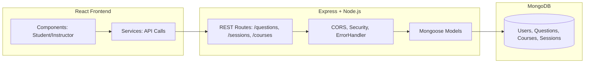

# VidyaVichar – Classroom Q&A Sticky Board  

VidyaVichar is a real-time classroom Q&A board built using the **MERN stack**.  
Students can post questions during lectures as colorful sticky notes. Instructors can filter, mark, and organize these questions without interrupting the class flow.  

---

##  Features
- Students post questions live during lectures.
- Questions appear as sticky notes on instructor’s board.
- Instructors can:
  - Mark questions as **answered** or **important**.
  - Filter questions (e.g., unanswered only).
  - Clear session data when needed.
- All questions are saved in **MongoDB** for later review and analytics.

---

##  MERN Implementation Details

### Frontend (React)
- Built with **React** functional components.  
- **Context API** used for global state management (sessions, questions).  
- Organized in modular folders: `components`, `pages`, `services`, `utils`.  
- Styled with **styled-components** and custom global styles.  
- Error handling through `ErrorBoundary.js`.  

### Backend (Node.js + Express)
- REST APIs built with **Express**.  
- Organized into routes (`/questions`, `/sessions`, `/courses`).  
- **Middleware** ensures:
  - CORS policy handling
  - Security headers
  - Error handling for all routes  
- Utilities for **session generation** and constants.  

### Database (MongoDB + Mongoose)
- Collections: **Users**, **Courses**, **Sessions**, **Questions**.  
- Each `Question` stores text, author, status (answered/unanswered/important), and timestamp.  
- Schemas in `models/` folder with Mongoose for schema validation and query abstraction.  

---

##  Project Structure
```
├── backend
│   ├── config/          # Database connection
│   ├── middleware/      # CORS, security, error handling
│   ├── models/          # Mongoose schemas
│   ├── routes/          # Express routes (courses, sessions, questions)
│   ├── utils/           # Constants & session helpers
│   └── server.js        # Entry point
├── frontend
│   ├── public/          # Static assets
│   ├── src/
│   │   ├── components/  # UI Components (instructor, student, common)
│   │   ├── context/     # React Context (App state)
│   │   ├── pages/       # Page-level views
│   │   ├── services/    # API layer (axios)
│   │   └── utils/       # Helpers, validators, constants
└── README.md
```

---

##  Setup & Installation

### 1. Clone Repository
```bash
git clone <repo-url>
cd VidyaVichar
```

### 2. Backend Setup
```bash
cd backend
npm install
# Add MongoDB URI in config/database.js or .env
npm run dev   # starts backend with nodemon
```

### 3. Frontend Setup
```bash
cd frontend
npm install
npm start     # runs React dev server
```

### 4. Environment Variables
Create a `.env` file inside `backend/` with:
```
MONGODB_URI=mongodb://localhost:27017/vidyavichar
```

---

##  Solution Diagram



---

##  Design Decisions
1. **Separation of Concerns:**  
   - Backend handles authentication, business logic, and persistence.  
   - Frontend manages user interactions, state, and UI rendering.  

2. **Scalability:**  
   - MongoDB schemas designed to store sessions and questions efficiently.  
   - Instructor dashboards allow easy filtering and retrieval.  

3. **Resilience:**  
   - Error boundaries in React (`ErrorBoundary.js`) to prevent UI crashes.  
   - Global error handler in Express ensures consistent responses.  

4. **Maintainability:**  
   - Modular services & context in frontend.  
   - Middleware-driven backend for cross-cutting concerns (security, CORS, error handling).  

---

##  Future Improvements
- Authentication & role-based access (student vs instructor).  
- Analytics dashboard for instructors (e.g., most asked topics).  
- Export Q&A sessions as reports.  
- WebSocket integration for **real-time updates** without refresh.  

---

##  Contributors
- Souradeep Das  
- Srinjoy Sengupta
- Kushal Mukherjee
- Keshav Dubey
- Rahul Ebenezer Chand